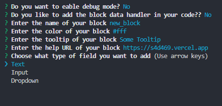
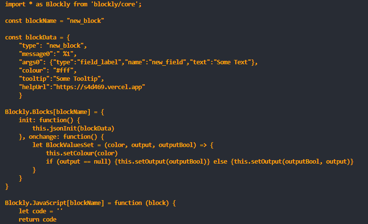

#  **S4D Block Generator**

### Use this CLI tool to generate your own  [Scratch for Discord](https://s4d469.vercel.app) blocks within seconds! 🧱
 

## **Simple to use!**
  ### Install the packages
  `npm i`
  ### Run node
  `node .`
  ### Answer the form
  

  ## **And get a new fresh Blockly block!**
  

## Made by LimeNade with ❤ ;)
